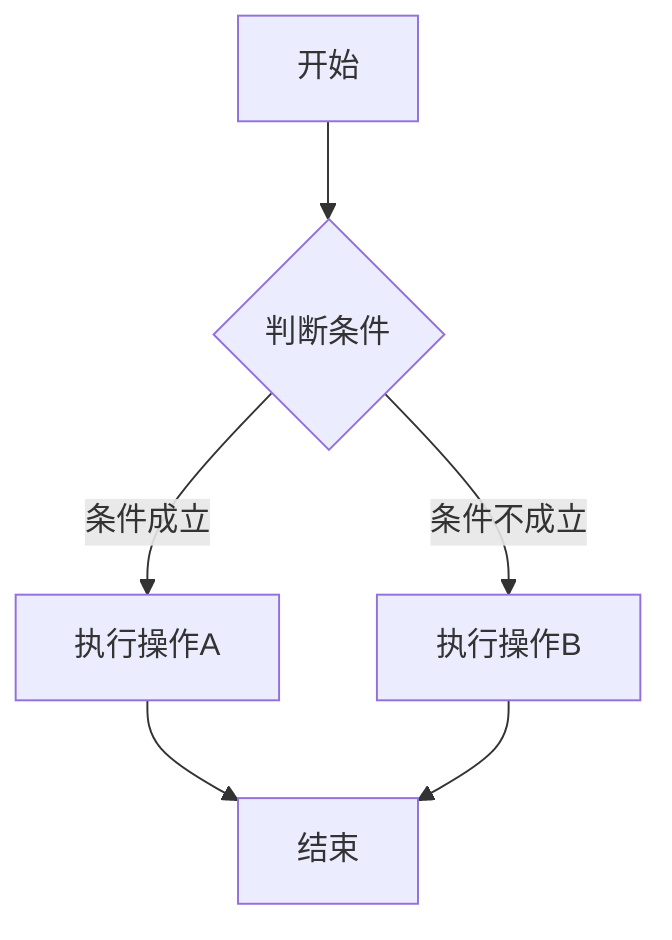
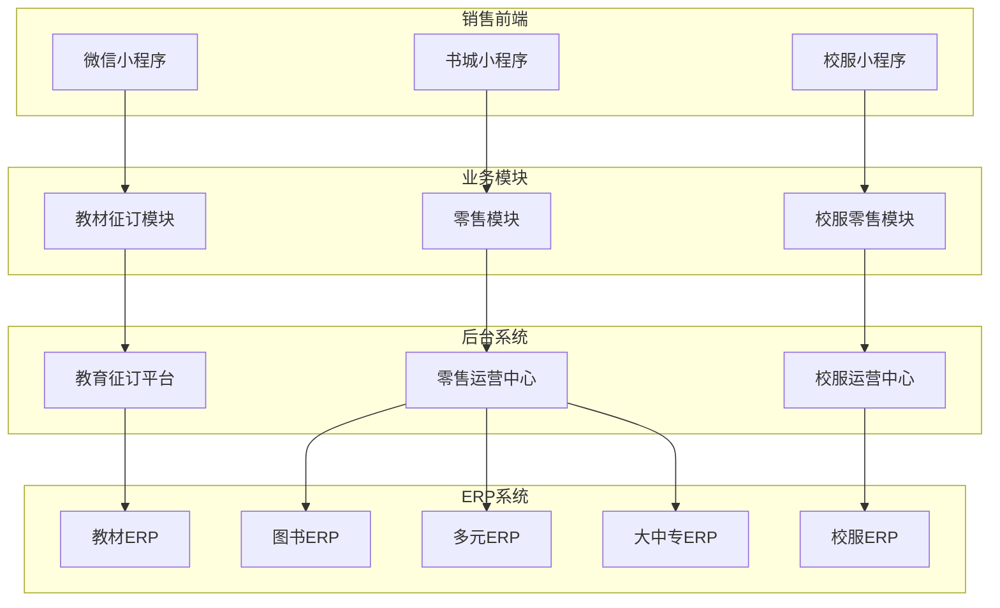

# AI应用基础知识：认识Markdown格式

> **类别**：入门指南  
> **作者**：团队知识库  
> **时间**：2025-06-24  
> **标签**：Markdown、入门、基础知识、文档格式

---

## 第一部分：什么是 Markdown（MD）格式

### 1.1 一句话定义

**Markdown** 是一种**轻量级标记语言**，它的核心理念是：**用纯文本快速写出格式化的文档**。

你只需要在纯文本中输入一些简单的标记符号（比如 `#`、`*`、`-` ），就能让文字变成标题、加粗、列表，甚至插入图片和代码。这些纯文本文件保存为 `.md` 或 `.markdown` 后缀，就是 Markdown 文件。

### 1.2 常见语法速查

以下是 Markdown 最常用的语法，每个都配有「源码」和「渲染效果」对比：

#### 标题

```markdown
# 一级标题
## 二级标题
### 三级标题
```

**渲染效果：**

# 一级标题
## 二级标题
### 三级标题

---

#### 加粗与斜体

```markdown
**这是加粗文字**
*这是斜体文字*
```

**渲染效果：**

**这是加粗文字**  
*这是斜体文字*

---

#### 列表

```markdown
- 无序列表项 1
- 无序列表项 2
  - 嵌套列表项

1. 有序列表项 1
2. 有序列表项 2
```

**渲染效果：**

- 无序列表项 1
- 无序列表项 2
  - 嵌套列表项

1. 有序列表项 1
2. 有序列表项 2

---

#### 链接与图片

```markdown
[点击访问百度](https://www.baidu.com)


```

**渲染效果：**

[点击访问百度](https://www.baidu.com)

> （图片示例需替换为实际图片地址）

---

#### 代码块

```markdown
这是一行普通代码：`console.log("Hello")`

```javascript
// 这是多行代码块
function sayHello() {
    console.log("Hello, Markdown!");
}
```
```

**渲染效果：**

这是一行普通代码：`console.log("Hello")`

```javascript
// 这是多行代码块
function sayHello() {
    console.log("Hello, Markdown!");
}
```

---

#### 表格

```markdown
| 姓名 | 年龄 | 城市 |
|------|------|------|
| 张三 | 28   | 北京 |
| 李四 | 32   | 上海 |
```

**渲染效果：**

| 姓名 | 年龄 | 城市 |
|------|------|------|
| 张三 | 28   | 北京 |
| 李四 | 32   | 上海 |

---

### 1.3 Markdown 与 HTML 的关系

Markdown 是 HTML 的「快捷写法」，MD 可以轻松转换为 HTML，但比 HTML 简单很多。

| Markdown | HTML | 说明 |
|---------|------|------|
| `# 标题` | `<h1>标题</h1>` | Markdown 是 HTML 的「快捷写法」 |
| `**加粗**` | `<strong>加粗</strong>` | 同样的效果，MD 更简单 |
| `- 列表` | `<ul><li>列表</li></ul>` | MD 大幅减少了代码量 |

**核心关系**：
- **Markdown 可以轻松转换为 HTML**，就像「手写便签」可以交给印刷厂印成精美海报。
- **MD 比 HTML 简单很多**，你不需要懂任何编程知识，几分钟就能上手。
- **最终效果一样**：无论是 MD 还是 HTML，渲染出来的页面效果几乎相同。

---

## 第二部分：Markdown 的常见应用场景

### 2.1 会议纪要及方案

需求文档、会议纪要、技术方案等办公场景，用 Markdown 都能快速搭建清晰的结构：

```markdown
# 项目周会纪要与方案

**时间**：2025-06-24 14:00
**参与人**：张三、李四、王五

## 一、需求概述
当前系统仅支持邮箱登录，用户反馈需要更便捷的登录方式。

## 二、会议决议
1. 支持手机号 + 验证码登录
2. 支持微信一键登录
3. 确定下周三进行内部测试

## 三、优化方案
1. 引入缓存机制，提升性能
2. 数据库读写分离
3. 异步任务队列

## 四、待办任务
| 任务 | 负责人 | 截止日期 |
|------|--------|----------|
| 完成 API 接口开发 | 张三 | 2025-06-28 |
| 编写测试用例 | 李四 | 2025-06-30 |
| 用户调研报告 | 王五 | 2025-06-27 |

## 五、预期效果
- QPS 提升 50%
- 响应时间降低 30%
```

### 2.2 整理 PPT 内容提示词

在让 AI 生成 PPT 之前，先用 Markdown 梳理好内容结构，再交给 AI 处理：

```markdown
# Q3 产品规划汇报

## 1. 回顾 Q2 成果
- 用户增长 30%
- 收入达成率 105%

## 2. Q3 核心目标
- 提升用户留存率至 60%
- 推出 2 个新功能模块

## 3. 关键举措
1. 优化新手引导流程
2. 完善用户反馈机制
3. 加强运营活动推广

## 4. 资源需求
- 新增 2 名前端工程师
- 申请市场推广预算 50 万
```

### 2.3 整理图片生成提示词

用 Markdown 结构化地整理 AI 图片生成提示词，方便管理和复用：

```markdown
# 产品宣传图提示词模板

## 基本信息
- **风格**：扁平化插画
- **色调**：蓝绿色系
- **比例**：16:9

## 场景 1：办公协作
```
Flat design illustration of a diverse team
working together in a modern office,
blue and green color scheme, clean and minimal,
soft shadows, professional atmosphere
```

## 场景 2：数据展示
```
Abstract data visualization with floating
charts and graphs, gradient blue background,
futuristic tech style, glowing elements,
16:9 aspect ratio
```
```

---

### 2.4 用 Mermaid 画流程图

Markdown 支持通过 Mermaid 语法，**用文字描述就能生成流程图**。无需任何绘图软件，几行文字即可。

**语法示例：**

```markdown

```

**渲染效果：**


**更复杂的示例（系统架构图）：**

```markdown

```

**推荐工具**：
- **在线编辑器**：[https://mermaid-live.nodejs.cn/](https://mermaid-live.nodejs.cn/) —— 实时编辑、预览和分享 Mermaid 图表
- **VS Code**：安装插件后可直接在 Markdown 中预览

---

## 第三部分：为什么要用 Markdown

### 3.1 纯文本，跨平台通用

Markdown 文件本质上是**纯文本文件**（`.txt` 的升级版），这意味着：

- ✅ **任何设备都能打开**：Windows、Mac、Linux、手机、平板
- ✅ **任何软件都能编辑**：记事本、VS Code、甚至手机备忘录
- ✅ **永远不会出现「打不开的文档」**：不像 Word 需要特定版本

### 3.2 格式简洁，专注内容创作

写 Word 文档时，你是不是经常陷入「调格式」的陷阱？

- ❌ 这个标题用几号字？
- ❌ 段落间距要不要调？
- ❌ 字体颜色配什么好看？

**用 Markdown，这些问题统统不存在。**

你只需要关注内容本身，格式通过简单的标记符号搞定。写完导出为 HTML 或 PDF，自动获得精美的排版效果。

### 3.3 AI 工具原生支持

现在几乎所有的 AI 工具（ChatGPT、Claude、Gemini、WorkBuddy 等）都**原生支持 Markdown**：

- AI 生成的回答默认就是 Markdown 格式
- 你可以用 Markdown 编写结构化的 Prompt，获得更精准的回复
- AI 可以帮你把 Markdown 转换为 PPT、Word、PDF 等各种格式

### 3.4 易于转换，一次编写到处使用

同一个 Markdown 文件，可以轻松转换为：

- **HTML** → 发布到网站或博客
- **PDF** → 打印或发送给客户
- **Word** → 给不熟悉技术的同事
- **PPT** → 制作演示文稿
- **电子书** → 发布到各大阅读平台

---

### 3.5 Markdown 的局限性

Markdown 虽然强大，但也有**不擅长的场景**：

| 不擅长的场景 | 原因 | 替代方案 |
|-----------|------|---------|
| **纯图片与文字混合排版** | MD 以文本为主，图片只能按顺序插入，难以做复杂的图文环绕、叠层等效果 | 使用 Word、PPT 或设计软件 |
| **复杂表格** | 表格语法较原始，不支持合并单元格、斜线表头等 | 使用 HTML 表格或 Word |
| **多栏布局** | 不支持分栏、侧边栏等复杂版式 | 使用 HTML/CSS 或专业排版工具 |
| **精确字体控制** | 无法控制字号、字重、行距等细节 | 使用 Word 或 InDesign |

**总结**：如果你需要写**技术文档、博客、笔记、需求文档、会议纪要**等以文字为主的内容，Markdown 是最佳选择。如果需要做**复杂的图文混排、海报、宣传册**，建议使用 Word、PPT 或专业设计工具。

---

## 第四部分：用什么软件阅读效果最好

### 4.1 VS Code + Markdown All in One 插件

**VS Code** 是阅读 Markdown 的最佳工具，免费、跨平台、功能强大。

#### 推荐插件：Markdown All in One

**安装步骤**：
1. 打开 VS Code
2. 点击左侧「扩展」图标（或按 `Ctrl+Shift+X`）
3. 搜索 `Markdown All in One`
4. 点击「安装」

**核心功能**：
- ✅ **实时预览**：编辑时右侧自动显示渲染效果
- ✅ **快捷键支持**：`Ctrl+B` 加粗、`Ctrl+I` 斜体、自动补全列表
- ✅ **目录生成**：自动提取文档目录，点击即可跳转
- ✅ **数学公式**：支持 LaTeX 公式渲染
- ✅ **导出功能**：一键导出为 HTML 或 PDF

**使用示例**：

```
打开任意 .md 文件 → 按 Ctrl+Shift+V → 右侧显示预览

编辑左侧源码时，右侧预览实时更新：

左侧源码：
# 我的文档
这是一段**加粗**的文字。

右侧预览：
# 我的文档
这是一段加粗的文字。
```

### 4.2 文本管理器阅读

如果你只是简单查看 Markdown 文件，**系统自带的文本管理器**（记事本、文本编辑器等）也可以阅读：

**Windows 记事本打开效果**：

```
# 项目会议纪要

**时间**：2025-06-24
**地点**：线上会议

## 议题
1. 本周进度同步
2. 下周计划确认

## 决议事项
- 确定下周三进行内部测试
- 用户调研报告周五前提交
```

**优点**：
- ✅ 无需安装任何软件，系统自带
- ✅ 打开速度快，轻量便捷
- ✅ 适合快速查看内容

**缺点**：
- ❌ 无法看到渲染效果（加粗、标题大小等）
- ❌ 不便于编辑和格式调整

**建议**：如果只是快速浏览内容，记事本够用；如果需要编辑或查看格式效果，建议使用 VS Code。

---

## 常见误区

#### ❌ 误区 1：Markdown 是编程语言

**正解**：Markdown 是标记语言，不是编程语言。你不需要学习编程，只需要记住几个简单的标记符号。

#### ❌ 误区 2：Markdown 不能做复杂排版

**正解**：Markdown 确实不适合做复杂的图文混排。但对于文档、博客、笔记等场景，完全够用。如果需要更复杂的排版，可以导出为 Word 或使用 HTML。

#### ❌ 误区 3：不同工具渲染效果不一样

**正解**：确实如此！不同工具对 Markdown 的渲染可能略有差异。但这恰恰是 Markdown 的优势——内容始终不变，只是展示方式不同。

---

## 总结

Markdown 是一种简单、高效、跨平台的文档格式。它的核心价值在于：

- ✅ **简单易学**：10 分钟上手，1 小时精通
- ✅ **专注内容**：告别繁琐的格式调整，回归写作本身
- ✅ **通用性强**：任何设备、任何软件都能打开
- ✅ **AI 友好**：与 AI 工具完美配合，提升工作效率
- ✅ **易于转换**：一次编写，到处使用

**局限性**：不擅长纯图片与文字混合的复杂排版，这类场景建议使用 Word 或 PPT。

无论你是程序员、设计师、产品经理还是学生，掌握 Markdown 都能让你的文档工作事半功倍。

**现在就开始你的 Markdown 之旅吧！** 🚀

---

*本教程持续更新中，如有建议欢迎反馈。*
